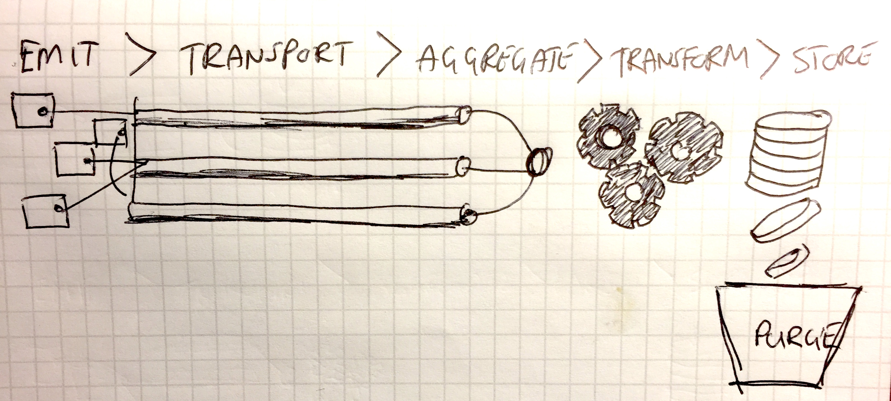

## [ Logging <br /> a system of indication <br /><small>NOT a system of record</small> ](#1)

<br><br>
<div align="middle">
<table width="40%">
<tr><td>

David Laing<br>
<small>Logsearch PM, Pivotal</small>
</td>
</tr>
</table>
</div>

---

### [ Logging systems ==> <span style="font-size:150%">A</span> in <span style="font-size:150%">CAP</span> ](#2)

```nohighlight
The long and short is that if you need to ensure your data in your 
log messages is "never" lost, logs are not the best place for this 
data.  Rather you should put this information in a more formal 
datastore like a database.  Such systems make different 
decisions/trade-offs ...

 -- Alex Jackson
```

<small><a href="https://groups.google.com/a/cloudfoundry.org/d/msg/vcap-dev/xRi_TNo58aE/5itmAuQfQp4J">https://groups.google.com/a/cloudfoundry.org/d/msg/vcap-dev/xRi_TNo58aE/5itmAuQfQp4J</small>

---

### [ Logging pipelines ](#2)

<div align="middle">
    
</div>

---

## [ Happy case ](#6)

* "Realtime"
* No overhead

---

## [ Failure case ](#6)

* Don't block
* Minimise noisy neighbour
* Favour recent over historic

---

## [ Tradeoffs at each step ](#6)

* Every component makes tradeoffs
* Simplicity / operability / speed <hr> &nbsp;&nbsp;&nbsp;&nbsp;&nbsp;&nbsp;&nbsp;&nbsp;&nbsp;&nbsp;&nbsp;&nbsp;&nbsp;&nbsp;&nbsp;&nbsp;&nbsp;&nbsp;&nbsp;&nbsp;correctness

---

## [ <span style="white-space: nowrap;">Emit <small>&gt; Transport &gt; Aggregate &gt; Transform &gt; Store</small></span> ](#6)

```java
logger.info(
  String.format("Funds updated successfully for account: %s",
    order.getAccountId()));
return repository.save(order);
```

---

## [ <span style="white-space: nowrap;"><small>Emit &gt;</small> Transport <small>&gt; Aggregate &gt; Transform &gt; Store</small></span> ](#6)

* Don't block
   * UDP - fire and forget
   * TCP with (truncating) buffer
* Doppler uses UDP by default
* Doppler max_buffer_length:100
* Sharded - failure looses 1/shard % of data

---

## [ <span style="white-space: nowrap;"><small>Emit &gt; Transport &gt;</small> Aggregate <small>&gt; Transform &gt; Store</small></span> ](#6)

* Lose order

---

## [ <span style="white-space: nowrap;"><small>Emit &gt; Transport &gt; Aggregate &gt;</small> Transform <small>&gt; Store</small></span> ](#6)

* Optimised for speed, not resiliancy.
* Errors - dropped

---

## [ <span style="white-space: nowrap;"><small>Emit &gt; Transport &gt; Aggregate &gt; Transform &gt;</small> Store</span> ](#6)

* Write throughput
* Not ACID / Eventual consistancy
* Replication for speed
* Statistical counts

---

## [ Purge ](#6)

* 14 - 30 days; then deleted
* No backup operational budget

---

## [ != a system of record ](#6)

* ALL components of log pipline optimised for
  * Low overhead
  * Low cost
  * Availability
  * Speed
* ==> NOT A TRANSACTIONAL DATABASE!

---

## [ Logs == system of indication ](#6)

* <span style="color:green; font-weight:bold; font-size:150%">YES</span>
  * Log message searching
  * Trending up / down
  * Percentile measurements
  * Approx counts

* <span style="color:red; font-weight:bold; font-size:150%">NO!</span>
  * Financial records
  * Compliance audit trails


